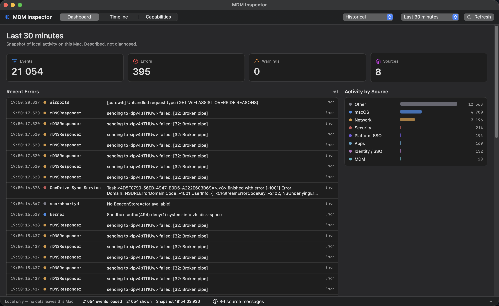
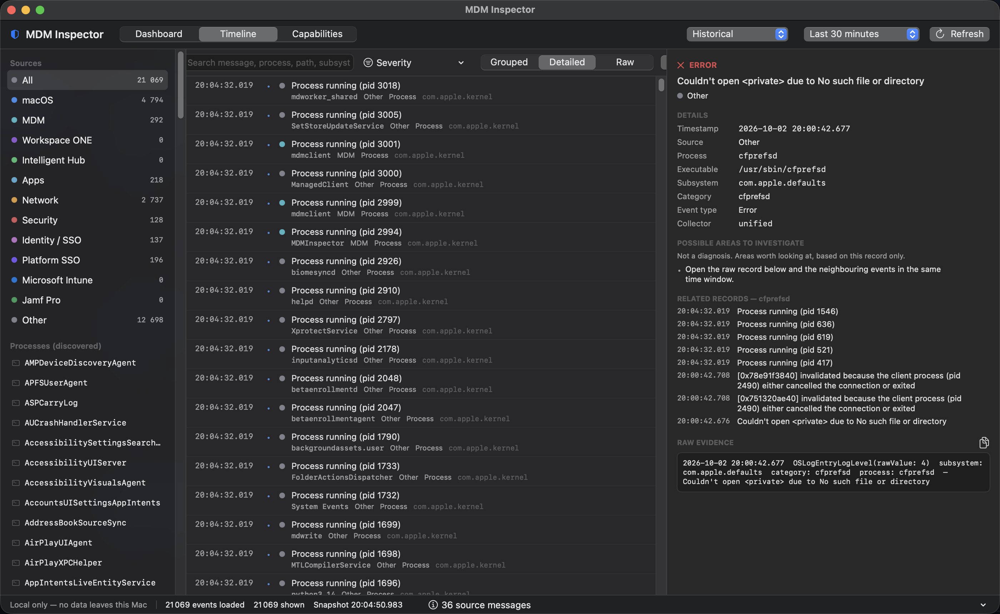
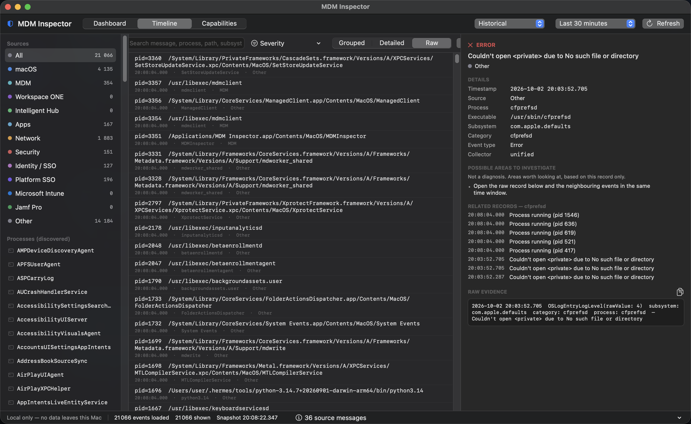
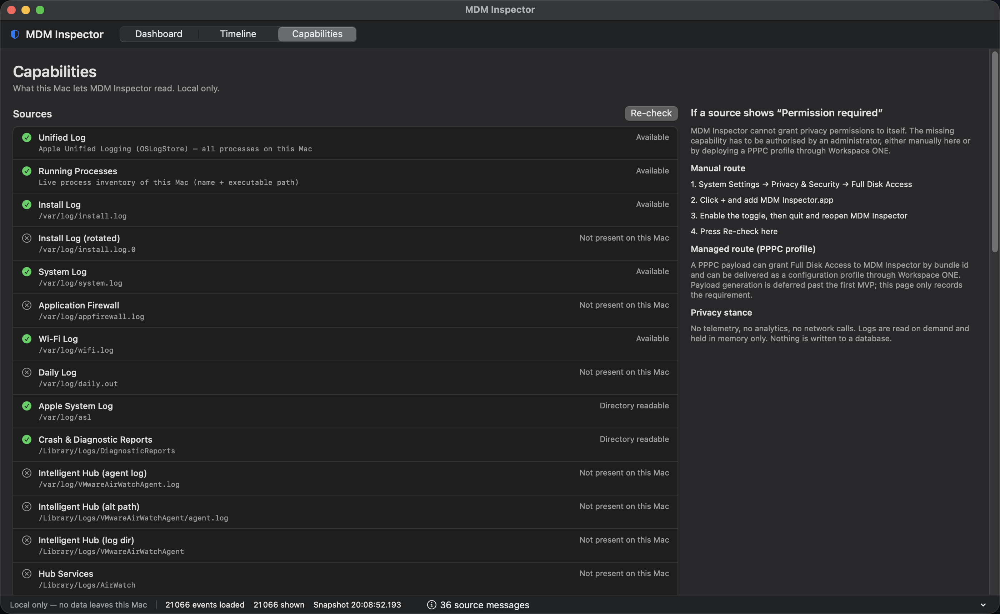

# MDM Inspector

[](LICENSE)

### The problem

Something went wrong on a Mac. An app didn't install. A profile didn't apply. The
Hub looks stuck. A user is getting prompts they shouldn't be.

The Mac has the answer. It is just spread across a dozen places:

```
/var/log/install.log                       macOS installer
Unified log  (log show --predicate …)      one subsystem at a time
/var/log/jamf.log                          Jamf client: jamf.log, jamfinstall.log
/Library/Logs/Microsoft/Intune             Intune agent: IntuneMDMDaemon, IntuneMDMAgent
~/Library/Logs/CompanyPortal.log           Company Portal
/var/log/VMwareAirWatchAgent.log           Workspace ONE Intelligent Hub
/Library/Logs/DiagnosticReports            crashes
…plus Console.app, filtered by hand, every time
```

So you read `install.log`, find nothing conclusive, pivot to Console, filter by
`subsystem`, wonder whether the failure is macOS or the agent that delivered the
package, go and read the agent's own log, notice the timestamps nearly line up,
and go back to the start.

**That is the scattered-logs problem.** The evidence is all on one machine. The
timing is what matters, and timing is exactly what scattered logs destroy.

### What this is

**"What happened on this Mac?"**

A native macOS app that puts those logs in one place and lays them out on a
single timeline, in order, with millisecond precision — so you can see that the
Hub download finished at `10:42:48.014`, `installer` started at `10:42:48.391`,
and it failed at `10:42:52.123`. Three sources, one story, one screen.

Run it on any managed Mac — the one in front of you, the one a user just handed
you, or the one you are about to ship. It reads only what that Mac has.

And when it shows you an error, the original log line is always one click away.
Interpretation never replaces evidence.

### Who it's for

Apple, Workspace ONE, Intune and Jamf administrators — the person who gets the
call when something is broken, not the person watching a dashboard.

### What it is not

Local only. No Workspace ONE or Intune API, no cloud backend, no telemetry, no
persistent database. Nothing leaves the Mac.

It reports **what the Mac knows**, not what you assume happened in the console.
If the local evidence shows a command arrived, it says the command arrived — and
it will not tell you the server processed it, because that evidence isn't here.

---

## Screenshots

All real runs on a live Mac — regenerated with `python3 tools/capture_screenshots.py`.

### Dashboard

Event, error, warning and source counts; recent errors (click any row to jump to
it in the Timeline); activity by source.



### Timeline and Inspector

Three panes: Sources sidebar with the discovered process list, millisecond-precision
event rows, and an Inspector showing a real event with its executable path,
subsystem, related records and raw evidence.



### Raw evidence

The original log record, verbatim — selectable and copyable with `⇧⌘C`. This is
the point of the tool: whatever the UI suggests, you can always get back to what
the system actually wrote.



### Capabilities

Per-source status, including an honest "not present on this Mac" for products
that aren't installed, plus the Full Disk Access remediation path.



## Contributing

New here, or new to GitHub? Start with **[CONTRIBUTING.md](CONTRIBUTING.md)** —
it explains the one distinction people trip over:

- **Issues** — feature requests, bugs, questions. This is what you want for
  tracking requests.
- **Pull requests** — a proposed change to the code itself.

Feature requests and bugs have forms that ask for the information needed to act
on them, so the New issue button offers **Feature request**, **Bug report** and a
blank issue. Usage questions are better in **Discussions**.

## Documentation

- **[docs/INTERFACE.md](docs/INTERFACE.md)** — a walk through every view and
  control: the dashboard, the timeline and its three display modes, the
  Inspector, the capabilities centre, Historical vs LIVE, and what the tool
  deliberately refuses to claim.

## Build & run

```zsh
./build_app.sh                       # release build → build/MDM Inspector.app
./build_app.sh --debug               # debug build
open "build/MDM Inspector.app"
```

Verify the collectors against this Mac's real logs:

```zsh
swift run -c release MDMInspectorSelfTest
```

Requires macOS 14+ and the Swift 6 toolchain (Command Line Tools are enough).

## Status

v0.1 — MVP-1 (application shell) and MVP-2 (real Unified Logs) are implemented
and verified, plus first-pass Workspace ONE, Intune, Jamf and Platform SSO
sources and a capabilities/permissions centre. Diagnostic intelligence (correlation,
loop detection, root-cause claims) is deliberately not built — see
"Known limits" below.

## What it reads

| Source | Kind | Notes |
|---|---|---|
| Unified Log | `OSLogStore(scope: .system)` | All processes, all subsystems |
| Running Processes | kernel process list | Name + executable path, works even when log reads are restricted |
| Install Log | `/var/log/install.log` (+ rotated) | |
| System Log | `/var/log/system.log` | |
| App Firewall / Wi-Fi / Daily / ASL | `/var/log/*` | |
| Crash & Diagnostic Reports | `/Library/Logs/DiagnosticReports` | |
| Intelligent Hub | VMware AirWatch log paths | WS1 evidence, local files only |
| **Microsoft Intune** | `/Library/Logs/Microsoft/Intune`, `~/Library/Logs/Microsoft/Intune`, `/Library/Logs/Microsoft/IntuneScripts`, `~/Library/Logs/CompanyPortal.log` | Paths per Microsoft Intune macOS docs |
| **Intune (unified log)** | subsystems `com.microsoft.intune*`, processes `IntuneMDMDaemon` / `IntuneMDMAgent` / `IntuneMMA` / `Company Portal` | |
| **Jamf Pro** | `/var/log/jamf.log`, `jamfinstall.log`, `jamf_setup.log`, `JAMFChangeManagement.log`, `/usr/local/jamf/bin` | Client paths per Jamf "Components Installed on Managed Computers" |
| **Jamf (unified log)** | subsystem `com.jamf*`, processes `jamf` / `JamfDaemon` / `JamfAgent` | Jamf docs: `subsystem BEGINSWITH "com.jamf.management.daemon"` |
| Microsoft AutoUpdate / InstallLogs, MSI, Adobe, Zscaler, SCCM, Cisco | log paths | Not-installed sources report as such, not as errors |

**Platform SSO (any IdP / any MDM)**

| Surface | Detail |
|---|---|
| Unified log | `com.apple.AppSSO`, `com.apple.extensiblesso`, `com.apple.heimdal`, plus vendor extension subsystems (Microsoft, Okta); processes `SSOExtension`, `AppSSOAgent`, `KerberosExtension`, `swcd` |
| Microsoft extension | `~/Library/Containers/com.microsoft.CompanyPortalMac.ssoextension/Data/Library/Caches/Logs/Microsoft/SSOExtension` |
| Okta Verify | `~/Library/Group Containers/B7F62B65BN.group.okta.macverify.shared/Logs` |

> Every vendor path above is taken from that vendor's own documentation, not
> guessed. A self-test asserts the documented Jamf client path is used and that
> the commonly-assumed `/Library/Logs/JAMF` (which does not exist) is absent.

### Events can belong to several sources

Company Portal is the clearest case: it is the Intune agent's user app **and**
the host of the Microsoft Enterprise SSO extension
(`com.microsoft.CompanyPortalMac.ssoextension`) that brokers Entra ID for
Platform SSO. Classifying it into a single bucket would hide it from exactly the
admin who needs it.

So `LogEvent.sources` is a list. A Company Portal record about an app install is
Intune only; a record about extensible-SSO registration is both
**Microsoft Intune · Platform SSO**. Filtering either category finds it, the
Inspector lists both, and search covers both. The same applies to any vendor's
SSO extension, which is what makes "Platform SSO with another MDM" work.

Sources are data, not code paths: add an entry in
`Collectors/CollectorRegistry.swift` and it becomes discoverable, filterable and
listed in the Capabilities tab.

## Architecture

```
Sources/
  MDMInspector/            ← library (models, collectors, views)
    Model/                 LogEvent, Severity, SourceCategory, TimeRange
    Collectors/            LogCollector protocol + implementations
    App/                   InspectorModel (the single source of view state)
    Views/                 Dashboard, Timeline, Inspector, Capabilities
  MDMInspectorApp/         ← thin @main App shim
  MDMInspectorSelfTest/    ← headless collector verification
```

`LogEvent` is the normalized model and is independent of where a record came
from, so any new collector feeds the same UI without touching it.

## Evidence rules (enforced in the code)

- **Evidence first** — every event keeps its `rawRecord`, selectable and copyable
  (`⇧⌘C`). Grouping never discards records; no repetition collapsing.
- **No diagnosis** — the app never claims root cause, "stuck", or "loop". Errors
  get factual "possible areas to investigate" hints, explicitly labelled as such.
- **No fabricated paths** — if a process isn't running, the executable shows `—`
  rather than a guess.
- **Honest diagnostics** — a source that isn't installed says "not present", not
  "permission required". Failures are surfaced, never swallowed.
- **Bounded reads** — the unified log can hold millions of records; a ring buffer
  keeps the newest N while still reporting the true matched count.

## Loading

A load takes a few seconds (the unified log is large), so the window shows a
progress bar under the toolbar:

- the current stage and source — `Unified Log — Read 12,418 records`
- a **live count of records discovered so far**, e.g. `14,203 logs`
- a percentage when the source can estimate one, an indeterminate bar when it
  cannot
- a gentle pulse on the dot and the bar fill so a long load reads as alive

The count is a real number, not a decorative ticker: every collector reports how
many records it has actually streamed, and the model sums them. A self-test
asserts the running total ends up exactly equal to the number of events loaded,
so it cannot drift into being an animation. Sources that cannot estimate still
advance the bar on completion, so it never stalls or jumps backwards.

Vendor unified-log sources only search a short recent window when none of their
processes are running, and say so explicitly rather than implying they searched
the whole range.

## Regenerating documentation screenshots

```zsh
python3 tools/capture_screenshots.py
```

Each view is opened through the app's launch arguments (`-startView`,
`-displayMode`, `-timeRange`) rather than by clicking, so captures are
reproducible. The script aborts if the screen is locked instead of saving a
picture of the login screen. Review the images before committing them.

## Test checklist

1. Launch → a progress bar appears under the toolbar showing the source, a
   live "N logs" count that climbs, and a percentage; it then disappears
   Dashboard shows non-zero **Events / Errors / Warnings / Sources**
11. Switch the time range to 24h — still responsive, bar still progresses
2. Switch time range 5m → 24h; counts change; no hang on 24h
3. Timeline tab: switch **Grouped / Detailed / Raw** — all three show the same
   event count (no evidence lost)
4. Select an event → Inspector shows timestamp, process, executable, subsystem,
   category, severity, and the raw record
5. `⇧⌘C` copies the raw record
6. Search box filters across message, process, path, subsystem, category
7. Sources sidebar filters; discovered process list narrows further
8. **LIVE** mode appends new events; scrolling up pauses follow
9. **Capabilities** tab lists every source with its real status
10. If the Unified Log shows *Permission required*: grant Full Disk Access, then
    quit and reopen the app

## Known limits (v0.1, per PRD)

Custom date ranges, automatic collapsing, health scores, root-cause claims,
loop detection, PPPC payload generation and remote investigation are deliberately
out of scope. 
